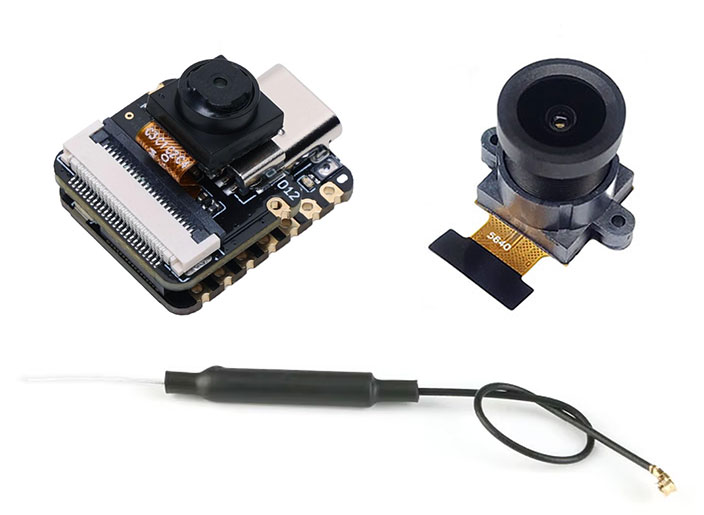
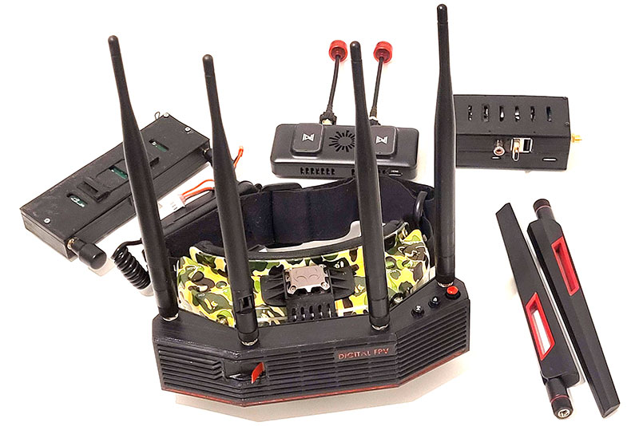

# hx-esp32-cam-fpv

Open source digital FPV system based on esp32cam https://romanlut.github.io/hx-esp32-cam-fpv/
- [x] Fully functional video link
- [x] Mavlink telemetry and RC
- [x] Displayport MSP OSD
- [x] GPIO Joystick
- [x] OSD Menu
- [x] documentation
- [x] test ov5640 sensor
- [x] better diagnostic tools
- [x] write proper format .avi on air and ground (seek support)
- [x] font selection for Displayport OSD
- [x] air unit channel search
- [x] test dual wifi cards performance
- [x] build dual wifi RPI GS
- [x] release prebuilt images and firmware
- [x] **Release v0.1.1**
- [x] HQ DVR mode: 1280x720x30fps(ov5640) recording with maximum quality on air unit, with low framerate transmission to GS
- [x] provide manual for running GS software on Ubuntu
- [x] composite output on RPI GS (PAL/NTSC, support for FPV glasses without HDMI input)
- [x] Joystick pinout compatible with RubyFPV
- [x] **Release v0.2.1**
- [x] pairing
- [x] radxa 3w GS
- [x] dualboot images
- [x] saving settings on camera
- [x] **Release v0.3.2**
- [x] use smaller packets for less losses (MTU selection)
- [x] ESP32 S3 OTA mode
- [x] camera web interface
- [x] **Release v0.4.3**
- [x] ESP32 C5 support
- [x] ESP32 C5 5GHz wifi support
- [x] **Release v0.5.3**
- [x] fisheye correction shader
- [x] EIS
- [x] Android GS
- [x] Meta Quest 2 GS
- [x] APFPV firmware
- [x] JPEG deblocking
- [x] **Release v0.6.3**
- [x] dual adapters support for Android and Oculus Quest GS
- [ ] dedicated GS unit with dual adapters and hardware buttons for Oculus Quest GS
- [ ] adjust esp32c5 video modes
- [ ] adjust esp32c5 air unit recording
- [ ] design esp32c5 air unit PCB
- [ ] dualboot image for RPI
- [ ] retransmissions ?
- [ ] measure latency properly
- [ ] study which components introduce latency
- [ ] Camera OSD elements position configuration
- [ ] telemetry logging
- [ ] telemetry sharing on RPI Bluetooth for Android Telemetry Viewer https://github.com/RomanLut/android-taranis-smartport-telemetry
- [ ] sound recording (esp32s3sense)?
- [ ] vignetting correction shader
- [ ] digital pan, zoom
- [ ] lost frames inpainting using neural network ?
- [ ] JPEG artefacts removal using neural network?

## Features:
- **esp32/esp32s3 + ov2640**: 640x360 30fps, 640x480 30fps, 800x456 30fps, 800x600 30fps, 1024x576 12fps
- **esp32/esp32s3 + ov2640 with sensor overclocking**: 640x360 40fps, 640x480 40fps, 800x456 40fps
- **esp32s3/esp32c5 + ov5640**: 640x360 30/50fps, 640x480 30/40fps, 800x456 30/50fps, 1024x576 30fps
- HQ DVR Mode: 1280x720 30fps (**esp32s3 + ov5640**) or 1280x720 12fps(**esp32/esp32s3 + ov2640**) recoding with maximum possible quality on Air, low FPS transmission to the ground 
- up to 1km at 24Mbps (actual transfer rate is ~8-10Mbps total with FEC 6/12), 600m at 36Mbps (actual transfer rate is ~10-12Mbps total with FEC 6/12) (line of sight)
- latency 90-110ms
- bidirectional stream for RC and telemetry 115200 Kbps (for Mavlink etc.)
- Displayport MSP OSD
- on-board and groundstation video recording

See a list of all supported sensor/boards combinations below.

**Air unit variants (VTX):**
- **esp32s3sense** with **ov5640** camera **(recommended)**
- **esp32s3sense** with **ov2640** camera
- **esp32cam** with **ov2640** camera
- **esp32c5** with **ov5640** camera **(experimental)**
- **esp32/esp32s3/esp32c5** with **ov3660** camera

**Ground station variants (VRX):**
- **Radxa Zero 3W/3E** with **rtl8812au** wifi card(s) **(recommended)**
- **Raspberry Pi Zero 2W** ... **Raspberry Pi 4B** with **rtl8812au** or **AR9271** wifi card(s)* 
- **Runcam WiFiLink VRX** - 5.8GHz only (experimental)
- **Android Phone or Tablet with rtl8812au USB adapter**
- **Oculus Quest 2/3 rtl8812au USB adapter**
- GS Software also can be run on x86_64 notebook on Ubuntu or Fedora Linux

# Recommended hardware

Although the project can be compiled for various platforms, the recommended hardware for optimal performance is:
- **VTX:** **Seed Studio XIAO ESP32S3 Sense** with **ov5640** camera, **M12** 120° lens, 2dBi dipole

- **VRX:** **Radxa Zero 3W** with dual **rtl8812au** wifi cards, 4x5dBi dipoles

# Theory

Wi-Fi bandwidth is insufficient for uncompressed video streaming, and the **ESP32** lacks the processing power for real-time video encoding. Fortunately, **OV*** camera modules can output frames as JPEG images. This project utilizes that feature to stream MJPEG video.

The camera continuously scans the image sensor and encodes the data row-by-row into JPEG format. These JPEG frames are transmitted to the **ESP32** over I2S at 10 MHz (or 20 MHz for **ESP32-S3** with OV5640), where they are optionally written to an SD card (if DVR mode is enabled), forward error correction (FEC) encoded, and streamed over Wi-Fi.

To reduce latency and memory usage, the esp32-camera component (https://github.com/espressif/esp32-camera) was modified to stream data directly from DMA as it arrives, rather than waiting for full frames. This cuts latency by 10–20 ms and minimizes PSRAM usage. As the camera captures the image, data is already in transmission to the Ground Station (GS).

Wi-Fi packets are transmitted using packet injection, a feature supported by the **ESP32**. FEC (forward error correction)  ensures that the GS can recover from packet loss without needing acknowledgments or retransmissions.

The air unit can also record video directly to an SD card. To compensate for the inconsistent write speeds of SD cards, a 3 MB buffer is used. The recorded video is identical in quality to the streamed version.

JPEG image sizes vary depending on scene complexity. Adaptive JPEG compression dynamically adjusts the quality level to match the available bandwidth and maintain smooth streaming.

The Ground Station can be a **Radxa Zero 3W**, **Raspberry Pi Zero 2W, up to Raspberry Pi 4**, equipped with Wi-Fi cards in monitor mode such as **Realtek 8812AU** (recommended), **Realtek 8821AU** or **AR9271**. Dual Wi-Fi cards can be used for diversity reception.

Since release 0.6.3, Android phone and Oculus Qeust 2/3 can be used for Ground station. **Realtek 8812AU** or **Realtek 8821AU** wifi card are still required for **Raw Broadcast** mode. In **APFPV mode**, built-in wifi can be used.

**8812au** with a low-noise amplifier (LNA) is preferred; however, a high-power amplifier (PA) is not critical since the range is primarily limited by the **ESP32's** maximum transmit power of 100 mW (20 dBm).

JPEG decoding on the GS is handled by TurboJPEG, achieving decoding times between 1–7 ms depending on resolution. Frames are uploaded as textures and rendered to screen.

On-screen display (OSD) elements are drawn using OpenGL ES.

The link is bi-directional, allowing the Ground Station to send data back to the air unit. Currently, this is used for camera and Wi-Fi configuration, as well as bi-directional telemetry streaming (also FEC encoded).

Here’s an example video captured at 30 FPS, resolution **800×456**, using an **OV2640** sensor with a 120° M8 lens:

https://github.com/RomanLut/esp32-cam-fpv/assets/11955117/970a7ee9-467e-46fb-91a6-caa74871fc3b

# Is it worth building?

**Set your expectations low**. This system begins with a very basic camera — the **OV5640** — comparable to smartphone cameras from around 2005. Using such a sensor means accepting several limitations:
- Noisy image
- Poor brightness/contrast handling, especially in backlit scenes
- Distorted and inaccurate colors
- Weak low-light performance
- Vignetting from cheap lenses
- Blurry corners due to poor focus
- High JPEG compression artifacts

In addition, the **ESP32** lacks hardware video encoding capabilities. As a result, the video stream is transmitted as a series of JPEG images — an inefficient method that wastes bandwidth and reduces potential image quality.

Given its low resolution, **esp32-cam-fpv** should be compared to cheap analog 5.8GHz AIO FPV cameras, not modern digital systems.

What you gain compared to analog AIO systems? For roughly the same price, **hx-esp32-cam-fpv** offers:
- Simultaneous video recording on both air unit and ground station
- Digital OSD
- Mavlink telemetry and RC control
- Telemetry logging
- Clean digital image with no analog interference

Key Drawbacks:
- Blocky JPEG compression
- No Wide Dynamic Range (WDR)
- Distorted color reproduction
- Poor low-light performance (especially with **OV2640**)
- Inconsistent quality between camera units
- Occasional frame drops

**hx-esp32-cam-fpv** is clearly outclassed by all commercial digital FPV systems in terms of image quality.

However, compared to other open-source digital FPV solutions like OpenHD, RubyFPV, or OpenIPC, it offers:
- low cost air unit
- Very compact size air unit (**XIAO ESP32-S3 Sense**)
- Low power usage (under 300mA at 5V)
- The same ground station hardware used for OpenHD/RubyFPV/OpenIPC can be reused — just swap the SD card.

https://github.com/RomanLut/hx-esp32-cam-fpv/assets/11955117/3abe7b94-f14d-45f1-8d33-997f12b7d9aa

# Modes of operation: Raw Broadcast / APFPV

The Air Unit can transmit video either in **Raw Broadcast mode** or in **APFPV mode**.

In **Raw Broadcast mode**, packets are transmitted using packet injection over a connectionless link.

In **APFPV mode**, the camera creates a **Wi-Fi access point** and the GS connects to it.

In both modes, only one GS can be connected to the Air Unit at the same time.

**Raw Broadcast** is the primary and recommended mode of operation. **APFPV mode** is not recommended for general use. **APFPV** requires establishing and maintaining a Wi-Fi connection to the access point, which can be unreliable or may fail completely. At long distances or with weak signal strength, this can result in losing the video feed for an extended period of time on Android devices, and especially Oculus Quest.

In general, **APFPV mode** is recommended only for ground vehicles.

Air Unit can be flashed with either **Raw Broadcast** or **APFPV** firmware. In fact, the firmware itself is the same - the only difference is the initial mode setting.
When switching between firmware types, make sure to fully erase the flash before reflashing. Otherwise, the mode may not change.

The Air Unit mode can be changed either from the GS menu or from the [camera web interface](/doc/web_interface.md)

> [!NOTE]
> **Raw Broadcast** mode works only with **RTL8812AU/RTL8821AU** adapter.

> [!NOTE]
> If the mode is changed from APFPV to Raw Broadcast using the GS menu, reconnecting to the Air Unit without an RTL8812AU adapter will no longer be possible. In this case, you must either reflash the Air Unit firmware or switch the mode back using the camera web interface.

https://github.com/RomanLut/hx-esp32-cam-fpv/assets/11955117/cbc4af6c-e31f-45cf-9bb4-2e1dd850a5d8

# Building

> [!NOTE]
> Please use **release** branch (it contains lastest release). **master** branch can be unstable.

Hint: For quick start, you can use Android GS and esp32cam in APFPV mode.

## Air Unit

| Air Unit Hardware | OV2640 | OV3660 | OV5640 | 2.4GHz | 5.8GHz | OTA Update | USB Disk | Wi-Fi File Server | DVR | I @ 5V | Guide |
|-------------------|:------:|:------:|:------:|:------:|:------:|:----------:|:--------:|:-----------------:|:-----------------:|-------------------|----------------|
| ESP32-CAM | + | + |  | + |  | + |  | + | + | <300mA | [Building guide](/doc/air_unit_esp32cam.md) |
| ESP32-S3 Sense | + | + | + | + |  | + | + | + | + | <300mA | [Building guide](/doc/air_unit_esp32s3sense.md) |
| ESP32-C5 |  | + | + | + | + | + |  | + | 1/4 speed1 | <300mA | [Building guide](/doc/air_unit_esp32c5.md) |

1 every 4th frame is recorded.

## Air Unit FPS

| Air Unit + Sensor | 640x360 | 640x480 | 800x456 | 800x600 | 1024x576 | 1280x720 |
|-------------------|:-------:|:-------:|:-------:|:-------:|:--------:|:--------:|
| ESP32 + OV2640 | 30/40 | 30/40 | 30/40 | 30 | 12 | 12 |
| ESP32 + OV3660 | 30/35 | 25 | 30/35 | 25 | 22.5 | 18.4 |
| ESP32-S3 + OV2640 | 30/40 | 30/40 | 30/40 | 30 | 12 | 12 |
| ESP32-S3 + OV3660 | 30/50 | 30 | 30/50 | 30 | 30 | 29 |
| ESP32-S3 + OV5640 | 30/50 | 30/40 | 30/50 | 30 | 30 | 30 |
| ESP32-C5 + OV3660 | 30/50 | 30 | 30/50 | 30 | 30 | 29 |
| ESP32-C5 + OV5640 | 30/50 | 30/40 | 30/50 | 30 | 30 | 30 |

## Ground Station

| GS Hardware Variant | 2.4GHz | 5.8GHz | Building Guide |
|---------------------|:------:|:------:|----------------|
| Radxa Zero 3W/3E | + | + | [Building guide](/doc/ground_station_radxa_zero_3.md) |
| Raspberry Pi Zero 2W | + | + | [Building guide](/doc/ground_station_raspberry_pi_zero_2w.md) |
| Raspberry Pi 2/3/4 | + | + | [Building guide](/doc/ground_station_raspberry_pi_2_3_4.md) |
| Android | + | + | [Building guide](/doc/ground_station_android.md) |
| Oculus Quest | + | + | [Building guide](/doc/ground_station_oculus_quest.md) |
| Runcam WiFiLink VRX |  | + | [Building guide](/doc/ground_station_runcam_wifi_link.md) |
| Eachine Sphere Link | + | + | [Building guide](/doc/ground_station_eachine_sphere_link.md) |
| Emax Wyvern Link VRX | + | + | [Building guide](/doc/ground_station_emax_wyvern_link.md) |
| Ubuntu | + | + | [Building guide](/doc/ground_station_ubuntu.md) |
| Fedora Linux Workstation | + | + | [Building guide](/doc/ground_station_fedora.md) |

## Radxa/RPI/Linux supported network cards

| Network card | 2.4GHz | 5.8GHz |
|--------------|:------:|:------:|
| RTL8812AU | + | + |
| RTL8811AU | + | + |
| RTL8812EU | ? | + |
| AR9271    | + | + |

? The chipset itself (e.g. RTL8822BU, RTL8812BU, RTL8821CU) supports both 2.4 GHz and 5 GHz, but the finished hardware may not implement both bands.

## Android/Oculus Quest supported network cards

This project uses [OpenIPC devourer](https://github.com/OpenIPC/devourer/tree/master) for Android/Oculus Quest Raw Broadcast Wi-Fi adapter support.

Tested cards: 

| Network card | 2.4GHz | 5.8GHz |
|--------------|:------:|:------:|
| RTL8812AU | + | + |
| RTL8821AU | + | + |

Untested cards:

| Network card | 2.4GHz | 5.8GHz |
| RTL8811AU | + | + |
| RTL8814AU | + | + |
| RTL8822BU | ? | + |
| RTL8812BU | ? | + |
| RTL8811CU | ? | + |
| RTL8821CU | ? | + |
| RTL8812CU | ? | + |
| RTL8822CU | ? | + |
| RTL8812EU | ? | + |
| RTL8822EU | ? | + |

? The chipset itself (e.g. RTL8822BU, RTL8812BU, RTL8821CU) supports both 2.4 GHz and 5 GHz, but the finished hardware may not implement both bands.

The support of untested cards are not mature in devourer. There are bugs. Please use tested cards.

----

# Features

[Displayport MSP OSD](/doc/displayport_msp_osd.md)

[Bidirectional serial connection](/doc/bidirectional_serial_connection.md)

[OSD Menu](/doc/osd_menu.md)

[Camera web interface and OTA update](/doc/web_interface.md)

[VR Mode](/doc/vr_mode.md)

[Latency](/doc/latency.md)

[USB Mass Storage mode (esp32s3)](/doc/web_interface.md#esp32-s3-usb-mass-storage-device)

# Other modes of operation

[Wifi channels scanning](/doc/wifi_channels_scanning.md)

[Test mode](/doc/test_mode.md)

[Recordings playaback](/doc/playback.md)

# Design considerations

[Image resolution selection](/doc/image_resolution_selection.md)

[Lens](/doc/lens.md)

[Wifi](/doc/wifi.md)

[DVR](/doc/dvr.md)

[Adaptive compression](/doc/adaptive_compression.md)

[FEC](/doc/fec.md)

[Known Wifi cards](/doc/wifi_cards.md)

[Antenas](/doc/antenas.md)

[Range](/doc/range.md)

[Dual Wifi Adapters](/doc/dual_wifi_adapters.md)

[Drivers](/doc/drivers.md)

# Development

[Development guide](https://github.com/RomanLut/hx-esp32-cam-fpv/blob/master/doc/development.md)

[Original project](/doc/original_project.md)

[Unsuccessfull attempts](/doc/unsuccessful_attempts.md)

# References

esp32c5-airunit-nano https://github.com/us3r-d0e5nt-3x1st/esp32c5-airunit-nano

ESP32-C5-CAM_Hardware  https://github.com/HaqqScripter/ESP32-C5-CAM_Hardware

Getting Started with Seeed Studio XIAO ESP32S3 (Sense) https://wiki.seeedstudio.com/xiao_esp32s3_getting_started/

# FAQ

[FAQ](/doc/faq.md)

https://github.com/user-attachments/assets/b0c2f0b5-2106-4702-b434-837e8ce5914b
