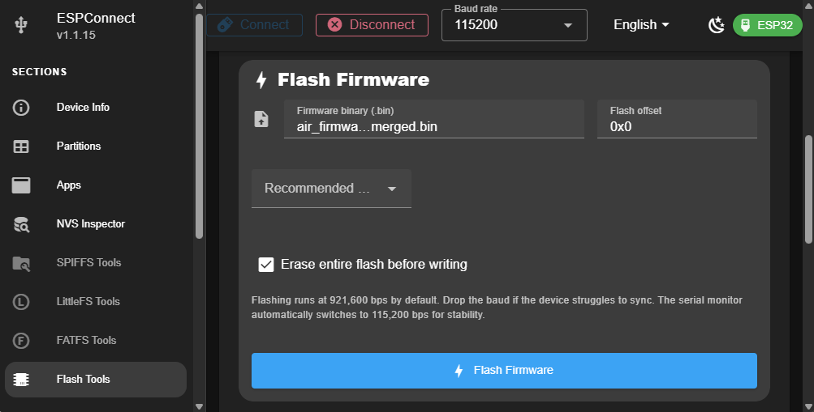
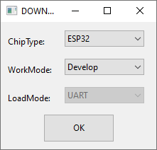
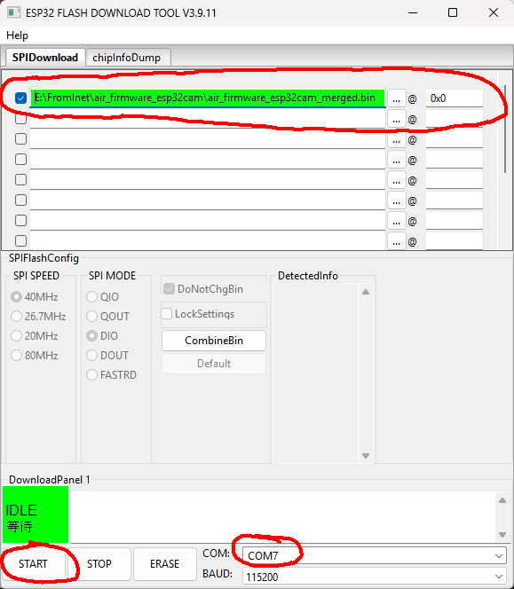

# Flashing esp32cam

**esp32-cam** with **esp32-cam-mb** adapter is recommended.

>Note: The only difference between the Broadcast and APFPV firmware is the default operating mode. You can switch between modes at any time through the OSD menu.
>
>If you are flashing APFPV over Broadcast firmware (or vice versa), you **must erase the flash during the update**. Otherwise, the existing settings will be preserved, and the device will continue using the previously selected mode.

## Flashing online 

Flash online from donwloads section on landing page:
https://romanlut.github.io/hx-esp32-cam-fpv/#firmware-by-board

## Flashing online using ESPConnect

* Download and uncompress prebuilt firmware files from https://github.com/RomanLut/hx-esp32-cam-fpv/releases
* Navigate to https://thelastoutpostworkshop.github.io/ESPConnect/
* Se speed to 115200
* Connect esp32-cam-mb adapter to USB, click **[Connect]**, select USB UART of **esp32cam**. You may need to enter flashing mode by holding **Boot** button whyle connecting power.
* Add **merged** firmware as shown on screenshot:
 


* It is recommented to check "Erase entire flash before writing" to reset settings
* Click **[Flash Firmware]**

## Flashing using Flash download tool

* Download and uncompress prebuilt firmware files from https://github.com/RomanLut/hx-esp32-cam-fpv/releases
* Download and uncommpress Flash Download tools https://www.espressif.com/en/support/download/other-tools
* Start Flash Download Tools, select esp32:


 
* Connect esp32-cam-mb adapter to USB
* Add firmware files as shown on screenshot:
 


* Make sure checkboxe is checked
* Make sure address is filled corectly (0x0)
* Make sure COM port is selected
* Click **[Start]**


## Building and Flashing using PlatformIO

* Download and install PlatformIO https://platformio.org/
 
* Clone repository: ```git clone -b release --recursive https://github.com/RomanLut/esp32-cam-fpv```

* Open project: **esp32-cam-fpv\air_firmware_esp32cam\esp32-cam-fpv-esp32cam.code-workspace**

* Let **PlatformIO** to install all components

* Connect **esp32cam** to USB

* Click **[PlatformIO: Upload]** on bottom toolbar.


# Over the Air update (OTA)

When **esp32cam** is installed on UAV, it would require desoldering to update firmware. 

There is easie alternative way using **Over The Air update (OTA)**. 

Hold **REC** button while powering up to enter **OTA mode**. 

**OTA/Fileserver mode** is indicated by LED blinking with 1 Hz frequency.

* Enter **OTA mode**.
* Connect to **esp32cam-fpv-config** access point.
* Navigate to http://192.168.4.1/ota
* Select **firmware_ota.bin** file.
* Click **Upload**

To upload firmware with Visual Studio Code, uncomment "OTA Update" lines in the ```platformio.ini```.
