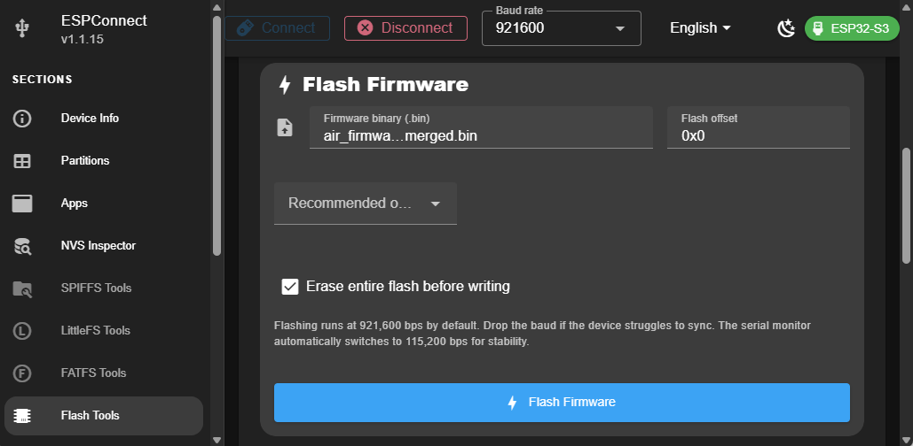
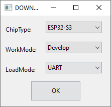
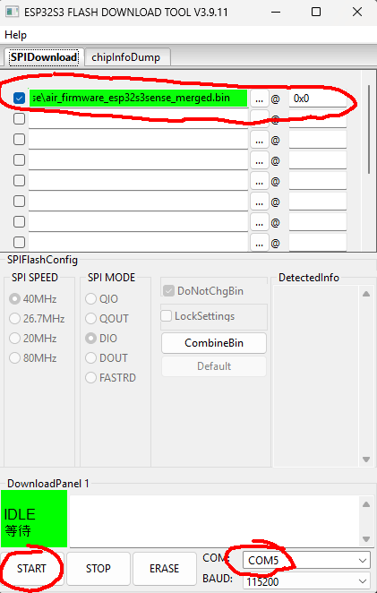

# Flashing esp32s3sense

>Note: The only difference between the Broadcast and APFPV firmware is the default operating mode. You can switch between modes at any time through the OSD menu.
>
>If you are flashing APFPV over Broadcast firmware (or vice versa), you **must erase the flash during the update**. Otherwise, the existing settings will be preserved, and the device will continue using the previously selected mode.

## Flashing using online tool

* Download and uncompress prebuilt firmware files from https://github.com/RomanLut/hx-esp32-cam-fpv/releases
* Navigate to https://thelastoutpostworkshop.github.io/ESPConnect/
* Connect **esp32s3sense** to USB, click ```[Connect]```, select ```USB JTAG/serial debug unit``` of **esp32s3sense**
* You may need to hold Boot (Rec) button while connecting power to enter flashing mode
* Add **merged** firmware file as shown on screenshot:
 


* Make sure address is filled corectly(0x0)
* It isrecommended tocheck "Erase entire flash" before writing to reset all settings
* Click ```[Program]```

## Flashing using Flash download tool

* Download and uncompress prebuilt firmware files from https://github.com/RomanLut/hx-esp32-cam-fpv/releases
* Download and uncompress **Flash Download tools** https://www.espressif.com/en/support/download/other-tools
* Start **Flash Download Tools**, select ```ESP32-S3```:


 
* Connect **esp32s3sense** to USB
* Add **merged** firmware file as shown on screenshot:
 


* Make sure checkboxe is checked
* Make sure addresses are filled corectly
* Make sure address is filled corectly (0x0)
* Make sure COM port is selected
* Click ```[Start]```


## Building and Flashing using PlatformIO

* Download and install PlatformIO https://platformio.org/
 
* Clone repository: ```git clone -b release --recursive https://github.com/RomanLut/esp32-cam-fpv```

* Open project: ```esp32-cam-fpv\air_firmware_esp32s3sense\esp32-cam-fpv-esp32s3sense.code-workspace```

  The same firmware supports both OV2640 and OV5640 cameras and detects the connected sensor at runtime.

* Let **PlatformIO** to install all components

* Connect **esp32s3sense** to USB

* Click ```[PlatformIO: Upload]``` on bottom toolbar.


# Over the Air update (OTA)

To enter OTA mode, connect the USB cable and wait 1 second. Then press and hold the REC button for 5 seconds, and release it to enter OTA mode.

>[!IMPORTANT]
>Do not hold the REC button while connecting power. If you do, the air unit will enter boot mode.


**OTA/Fileserver mode** is indicated by LED blinking with 1 Hz frequency.

* Enter **OTA mode**.
* Connect to **esp32cam-fpv-config** access point.
* Navigate to http://192.168.4.1/ota
* Select **firmware_ota.bin** file.
* Click **Upload**

To upload firmware with Visual Studio Code, uncomment "OTA Update" lines in the ```platformio.ini```.

# Solving constant reboot problem (unbricking)

Sometimes after unsuccesfull flashing, **esp32s2sense** constantly reboots, and it is impossible to flash firmware because USB device disappears/appears in the system every two seconds.

To resolve this problem:
* Download and uncompress **Flash Download tools** https://www.espressif.com/en/support/download/other-tools
* Start Flash Download Tools, select ```ESP32-S3```
* Connect **esp32s3sense** to USB while holding ```Boot```, release ```Boot``` button
* Click ```[Erase]```

