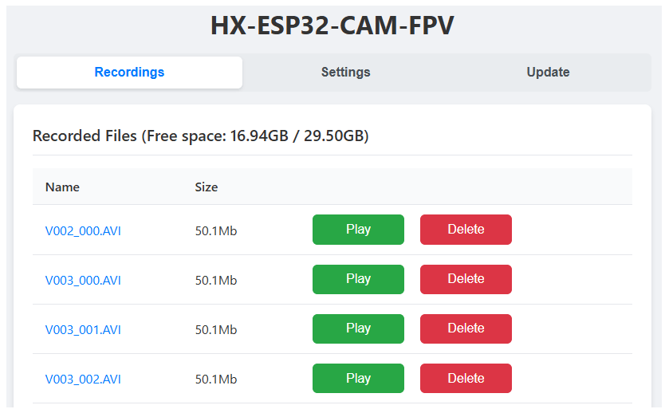
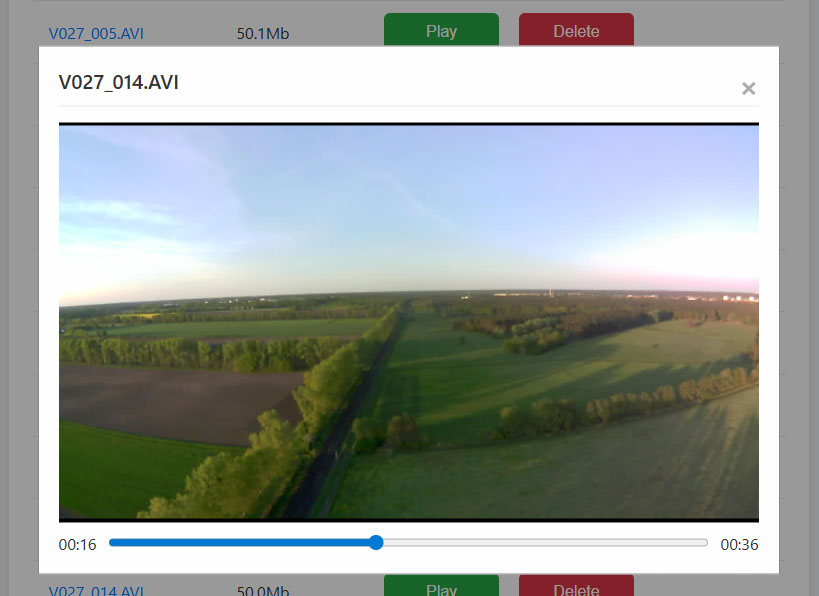
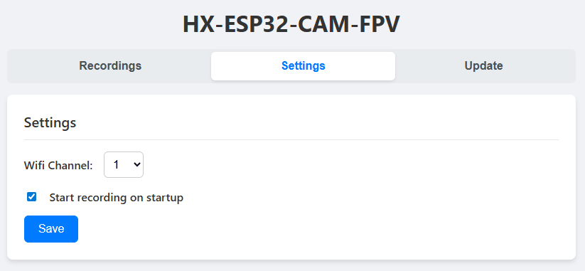
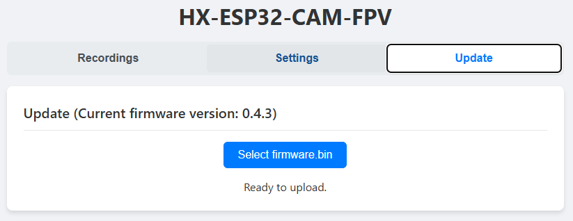

# Web Interface

The **web interface** is available in **OTA mode**.

## Entering OTA Mode

### ESP32-CAM

To enter OTA mode on **ESP32-CAM**:

1. Hold the **Boot** button  
2. Power on the ESP32-CAM while holding the button

### ESP32-S3 and ESP32-C5

To enter OTA mode on **ESP32-S3/C5**:

1. Power on the ESP32-S3/C5
2. Wait **3 seconds**  
3. Press and hold the **Boot** button  
4. Keep holding 5 seconds, than release
5. The **status LED starts blinking** at 1 Hz rate

> **Note:**  If you press **Boot** too early (immediately after power-up), the ESP32-S3/C5 will enter **bootloader mode**, not OTA mode.

### ESP32-S3 USB Mass-Storage Device

In web interface mode, SD Card is mounted as USB Mass-Storage Device on ESP32-S3.

# Web Interface Usage

Connect to the **esp32vtx** access point (no password).  
Then open:

**http://192.168.4.1**

The web interface contains three tabs:

- **Recordings**
- **Settings**
- **Update**

The **Recordings** tab allows you to **Download**, **Play**, and **Delete** recordings.

## Settings 

## Updating firmware

Open your browser and go to: **http://192.168.4.1/ota**. Upload **firmware.bin**

## Notes

- Avoid **downloading files concurrently** — ESP32 has limitations on simultaneous connections.
- **Seeking** may not work on **Apple devices**.
- Avoid using USB MSC and web interface concurrently.
